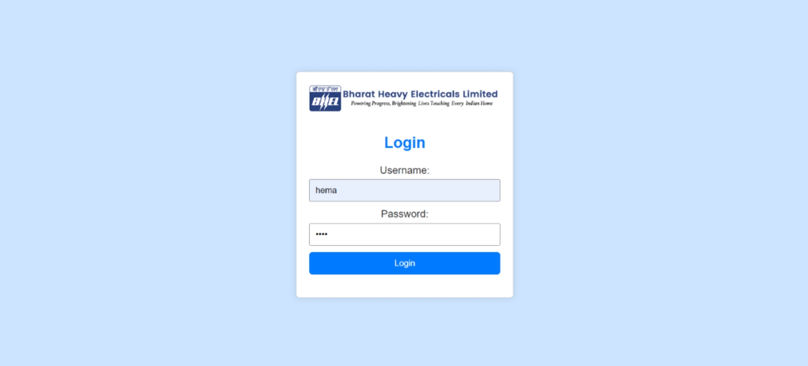

# Visitor Management System (ASP.NET MVC)

A full-stack **Visitor Management System** developed using **ASP.NET MVC**, **Entity Framework**, and **Microsoft SQL Server** to digitalize visitor registration, approval, tracking, and gate-pass management within an organization.

This project was developed as part of an **industry internship** and focuses on secure workflows, structured data handling, and real-world enterprise use cases.

---

## 🚀 Features

- Secure user authentication
- Visitor registration and gate pass request
- Admin approval and rejection workflow
- Visitor tracking and gate pass management
- Gate pass listing and printing
- Centralized database using MS SQL Server
- Responsive and user-friendly interface

---

## 🏗️ Technology Stack

### Frontend
- ASP.NET MVC (Razor Views)
- HTML5, CSS3
- Bootstrap
- JavaScript

### Backend
- ASP.NET MVC
- C#
- Entity Framework (ORM)

### Database
- Microsoft SQL Server

### Tools
- Visual Studio
- SQL Server Management Studio (SSMS)

---

## 🧠 Database Design

The system uses a normalized relational database with the following entity relationships:

- Visitor and Visitor_Request store core visitor visit information
- Employee and Department define host and department assignments
- Nationality and Document tables enrich visitor identity data
- Allowed_Items and Item_Details track visitor-brought items
- Approval_Status and Request_Status govern workflow state

---

## 🧠 System Architecture

The application follows the **Model–View–Controller (MVC)** architecture:

- **Models** handle business logic and database entities  
- **Views** manage the user interface and user interactions  
- **Controllers** process requests and manage application flow  

Entity Framework is used for database communication, ensuring data integrity, scalability, and maintainability.

---

## 📁 Project Structure

- src.zip       : Complete ASP.NET MVC source code (download and extract)
- database/     : ER diagram and SQL schema
- docs/         : Project report and presentation
- screenshots/  : Application output screenshots

---

## ⚙️ How to Run the Project

1. Download and extract `src.zip`
2. Open `VisitorManagementSystem.sln` in **Visual Studio**
3. Configure the SQL Server connection string in `appsettings.json`
4. Ensure **SQL Server** is running
5. Apply migrations / create database if required
6. Build and run the project

---

## 📊 Use Cases

- Corporate offices
- Manufacturing plants
- Educational institutions
- Government organizations
- Secure facilities requiring visitor monitoring

---

## 📈 Future Enhancements

- Role-based access control
- QR-code based gate passes
- Email/SMS visitor notifications
- Visitor analytics dashboard
- Cloud deployment (Azure)

---

## 👩‍💻 Author

**Hema Varsini R**  
B.Tech – Computer Science & Engineering  
(Artificial Intelligence & Data Analytics)

---

## ✅ Acknowledgement

This project was developed as part of an internship program with industry guidance and academic supervision.  
It reflects practical exposure to full-stack development and enterprise application design.
